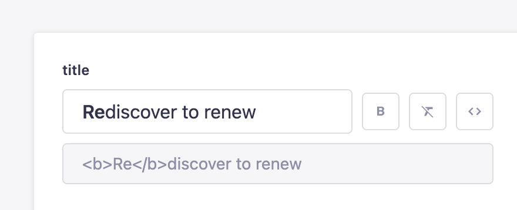

# Strapi plugin Bold title editor

A bold title/text editor to accentuate **certain parts** through HTML or Markdown.

## ✨ Features
* **Different output options:** choose between HTML and Markdown.
* **Actions:** accentuate **certain parts**, preview code output and clear text format.

## ⏳ Installation

```sh
# Using Yarn
yarn add @ef2/strapi-plugin-bold-title-editor

# Or using NPM
npm install @ef2/strapi-plugin-bold-title-editor
```

Then, you'll need to build your admin panel:

```sh
# Using Yarn
yarn build

# Or using NPM
npm run build
```

## 🎉 Usage



### HTML
#### React/Next.js

```tsx
<h1 dangerouslySetInnerHTML={{ __html: title }} />
<h3><a href="#" dangerouslySetInnerHTML={{ __html: title }} /></h3>
```

#### Vue
```html
<h1 v-html="title" />
<h3><a href="#" v-html="title" /></h3>
```

### Markdown
#### React

```tsx
import ReactMarkdown from 'react-markdown'

<ReactMarkdown children={title} />
```
